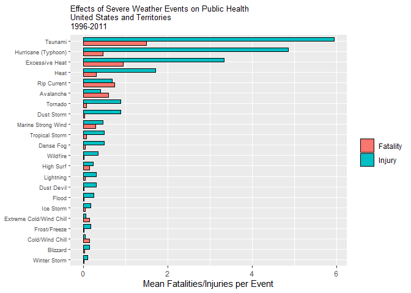
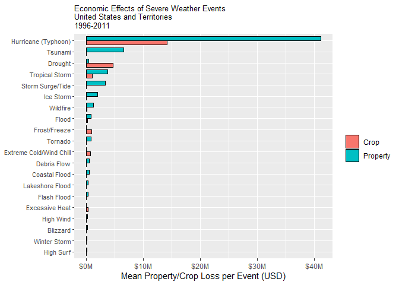

- [Synopsis](#heading-id1)  
- [Data Processing](#heading-id2)  
	- [Dataset Description](#heading-id3)  
	- [Table 1 - Composition of Severe Weather Events Dataset](#heading-id4)  
	- [Data Preparation Workplan](#heading-id5)  
- [Results](#heading-id6)  
- [Chart 1 - Effects of Severe Weather Events on Public Health](#heading-id7)  
- [Chart 1 Analysis](#heading-id8)  
- [Chart 2 - Economic Effects of Severe Weather Events](#heading-id9)  
- [Chart 2 Analysis](#heading-id10)


##### **Synopsis:** {#heading-id1}

Despite technological advances in both weather prediction and public warning systems, severe weather events can have profound public health and economic effects in the United States and its territories. Using severe weather event data collected by the National Weather Service (NWS) between 1950-2011, this analysis will provide insight into the types of severe weather events which have the highest negative impact on public health (fatalities and injuries) and property ownership (property and agricultural crop damage). Specifically, these questions will be addressed:

1. Across the United States, which types of events are most harmful with respect to population health?
2. Across the United States, which types of events have the greatest economic consequences?

Comparisons will be performed on the forty-eight Severe Weather Event Types enumerated in the NWS Directive 10-1605 in effect when the dataset was created. Although the NWS dataset contains events dating back to 1950, complete data for all forty-eight events wasn't available until 1996. In order to accurately compare 'apples to apples', minimize the potential impact of global warming on severe weather frequency, intensity, etc., and mitigate the possible introduction of outliers, this analysis will be limited to the years 1996-2011 for which complete records are available.

### *Data Processing* {#heading-id2}

##### **Dataset Description** {#heading-id3}
As mentioned in the synopsis above, the severe weather event database, on which the dataset for this analysis is derived, is based on the forty-eight severe weather event types included in Table 1, Storm Data Event Table, in NWS Directive 10-1605 (August 17, 2007). However, as the table below illustrates, data for years prior to 1996 is  available only for a small subset of event types.

###### *Table 1 - Composition of Severe Weather Events Dataset* {#heading-id4}

| Year(s) | Severe Events Collected | Collection Medium | Additional Information |
| :------- | :------ | :------ | :------ |
| 1950-1954 | Tornado | Transcribed from Paper ||
| 1955-1992 | Tornado, Thunderstorm Wind, Hail | Transcribed from Paper ||
| 1993-1995 | Tornado, Thunderstorm Wind, Hail | Unformatted Text File ||
| 1996-1999 | 48 Event Types from NWS Directive 10-1605 | Storm Data Software | Event Type Field As Free-Text |
| 2000-2011 | 48 Event Types from NWS Directive 10-1605 | Storm Data Software | Event Type As Drop-Down |

The dataset features both descriptive (e.g. state/county, fatalities/injuries, property/crop damages, additional remarks) and physical (e.g. start and end date/time, start and end location(s), latitude/longitude coordinates) information for each severe weather event. Exact details of the dataset structure can be seen below.

**Note:** the URL and data for this assignment have been provided by Johns Hopkins/Coursera. The data for all years has been consolidated into a single zip file.

##### **Data Preparation Workplan** {#heading-id5}

1. ***Download Source Data/Load into R*** - The National Weather Service Severe Weather Event Database is hosted by the National Centers for Environmental Information (NCEI) at https://www.ncdc.noaa.gov/stormevents/. The data is organized by year and includes three files: StormEvents_details, StormEvents_fatalities and StormEvents_locations. This analysis works exclusively with the StormEvents_details data. 

2. ***Check for Duplicate Rows*** - A check was made with the distinct function to ensure all rows were unique. There were no duplicate rows in the dataset.

3. ***Remove Variables Outside the Scope of this Analysis*** - Because the dataset is large and the focus of this analysis is narrow in scope, the dataset has been subsetted to only include the following variables: BGN_DATE, STATE, EVTYPE, FATALITIES, INJURIES, PROPDMG, PROPDMGEXP, CROPDMG, CROPDMGEXP and REMARKS.

4. ***Reassign Events Not Coded to Standard Event Types*** - As mentioned above, there were forty-eight standard event types in effect at the time the dataset was created. The dataset actually contains more than 980 event types (no NA's). There are a couple of reasons for this occurence:
- Preparers of severe weather event submissions for years 1996-1999 were not restricted in what they could enter for the event type (starting in 2000, only standard types could be selected). As stated on the NCEI web site, this resulted in 'many, many variations of event types'.
- The standard event types change over time. At the time of this report, there are fifty-five event types. The event type descriptions change over time as well. On Page 1 of the NWS Directive 10-1605 (August 17, 2007) used for this analysis, Landslide was changed to Debris Flow. The event types for past submissions were not updated for any prospective changes to the event codes.
- An effort was made to normalize the event types to those in effect at the time the dataset was created. A further effort was made to minimize any interpretation on the analyst's part. However, some assumptions were used:
	- For rows where multiple weather events were listed in the event type (e.g. SNOW/SLEET/FREEZING RAIN), it was assumed the first item was the predominant event and was coded accordingly.
	- For rows where the result of an event was listed as the event type (e.g. Hypothermia or Dam Break), the Remarks variable was reviewed to find the root weather event unless it was obvious in the event type description.
	- For rows where the event type was sufficiently vague regarding intensity/magnitude (e.g. High Winds vs. Strong Winds or Winter Weather vs. Winter Storm), the Remarks variable was reviewed for quantitative descriptors (i.e. wind speed, inches of snow fallen) which were then compared to the definitions in NWS Directive 10-1605.

5. ***Reassign Events Coded to Event Type 'Other'*** - The Remarks variable was reviewed to determine the prime weather event. Rows where the weather event could not be reasonably determined were dropped from the analysis.

6. ***Remove Events Not Deemed Severe*** - Rows with event types like 'None', 'Normal Precipitation' were dropped from the analysis.

7. ***Normalize Property/Crop Damage Estimates*** - The estimated dollar amounts for property and crop damages have to be determined by looking at two variable within the dataset: PROPDMG (or CROPDMG) and PROPDMGEXP (or CROPDMGEXP). The P/CROPDMG variable contains a number and the P/CROPDMGEXP variable contains a multiple designator (K - thousands, M - millions and B - billions). The dollar amount of a loss estimate can only be computed by using both variables in tandem. The dataframe was expanded to include variables for normalized loss estimates.

8. ***Convert the BGN_DATE (Begin Date) variable to YEAR*** - The event begin month and date are inconsequential to this analysis and so were removed from the dataset. The Year was retained for filtering purposes.

9. ***Subset Dataframe to Include Years With Complete Severe Weather Event Data*** - As mentioned at certain points throughout this document, data for severe weather events prior to 1996 was limited to only the Tornado, Hail and Thunderstorm Wind event types. Aside from the worthy goal of comparing 'apples to apples', there is a concern, because of the breadth of the data (sixty-one years), about the effect of global warming on the increase/decrease of severe weather events in the United States. Assuming complete data for all years was available, could the weather of 1950 even be accurately compared to that of 2011? Due to this uncertainty, the analysis in this document will be limited to those years for which full weather data is available, 1996-2011.


```r
## load required libraries
library(stringr)
library(lubridate)
```

```
## 
## Attaching package: 'lubridate'
```

```
## The following objects are masked from 'package:base':
## 
##     date, intersect, setdiff, union
```

```r
library(dplyr)
```

```
## 
## Attaching package: 'dplyr'
```

```
## The following objects are masked from 'package:lubridate':
## 
##     intersect, setdiff, union
```

```
## The following objects are masked from 'package:stats':
## 
##     filter, lag
```

```
## The following objects are masked from 'package:base':
## 
##     intersect, setdiff, setequal, union
```

```r
library(tidyr)
library(ggplot2)
```


```r
## download dataset
fileURL <-
	"https://d396qusza40orc.cloudfront.net/repdata%2Fdata%2FStormData.csv.bz2"

if (!file.exists("repdata_data_StormData.csv.bz2")) {
	download.file(fileURL, "repdata_data_StormData.csv.bz2")
}

## unzip/load dataset into R dataframe
df <- read.csv(
	"repdata_data_StormData.csv.bz2",
	header = TRUE,
	strip.white = TRUE,
	blank.lines.skip = TRUE,
	quote = "\"",
	row.names = NULL
)

## display dataset characteristics
str(df)
```

```
## 'data.frame':	902297 obs. of  37 variables:
##  $ STATE__   : num  1 1 1 1 1 1 1 1 1 1 ...
##  $ BGN_DATE  : chr  "4/18/1950 0:00:00" "4/18/1950 0:00:00" "2/20/1951 0:00:00" "6/8/1951 0:00:00" ...
##  $ BGN_TIME  : chr  "0130" "0145" "1600" "0900" ...
##  $ TIME_ZONE : chr  "CST" "CST" "CST" "CST" ...
##  $ COUNTY    : num  97 3 57 89 43 77 9 123 125 57 ...
##  $ COUNTYNAME: chr  "MOBILE" "BALDWIN" "FAYETTE" "MADISON" ...
##  $ STATE     : chr  "AL" "AL" "AL" "AL" ...
##  $ EVTYPE    : chr  "TORNADO" "TORNADO" "TORNADO" "TORNADO" ...
##  $ BGN_RANGE : num  0 0 0 0 0 0 0 0 0 0 ...
##  $ BGN_AZI   : chr  "" "" "" "" ...
##  $ BGN_LOCATI: chr  "" "" "" "" ...
##  $ END_DATE  : chr  "" "" "" "" ...
##  $ END_TIME  : chr  "" "" "" "" ...
##  $ COUNTY_END: num  0 0 0 0 0 0 0 0 0 0 ...
##  $ COUNTYENDN: logi  NA NA NA NA NA NA ...
##  $ END_RANGE : num  0 0 0 0 0 0 0 0 0 0 ...
##  $ END_AZI   : chr  "" "" "" "" ...
##  $ END_LOCATI: chr  "" "" "" "" ...
##  $ LENGTH    : num  14 2 0.1 0 0 1.5 1.5 0 3.3 2.3 ...
##  $ WIDTH     : num  100 150 123 100 150 177 33 33 100 100 ...
##  $ F         : int  3 2 2 2 2 2 2 1 3 3 ...
##  $ MAG       : num  0 0 0 0 0 0 0 0 0 0 ...
##  $ FATALITIES: num  0 0 0 0 0 0 0 0 1 0 ...
##  $ INJURIES  : num  15 0 2 2 2 6 1 0 14 0 ...
##  $ PROPDMG   : num  25 2.5 25 2.5 2.5 2.5 2.5 2.5 25 25 ...
##  $ PROPDMGEXP: chr  "K" "K" "K" "K" ...
##  $ CROPDMG   : num  0 0 0 0 0 0 0 0 0 0 ...
##  $ CROPDMGEXP: chr  "" "" "" "" ...
##  $ WFO       : chr  "" "" "" "" ...
##  $ STATEOFFIC: chr  "" "" "" "" ...
##  $ ZONENAMES : chr  "" "" "" "" ...
##  $ LATITUDE  : num  3040 3042 3340 3458 3412 ...
##  $ LONGITUDE : num  8812 8755 8742 8626 8642 ...
##  $ LATITUDE_E: num  3051 0 0 0 0 ...
##  $ LONGITUDE_: num  8806 0 0 0 0 ...
##  $ REMARKS   : chr  "" "" "" "" ...
##  $ REFNUM    : num  1 2 3 4 5 6 7 8 9 10 ...
```


```r
## check for duplicate rows
distinct(df)
## this function returns verbose results (i.e. all of the unduplicated rows. thus, the results were hidden at the time of publishing to improve readability. There are no duplicated rows in the dataset.
```


```r
## subset the dataframe to include only those variables required for this analysis
df1 <- subset(df, select = c(BGN_DATE, STATE, EVTYPE, FATALITIES, INJURIES, PROPDMG, PROPDMGEXP, CROPDMG, CROPDMGEXP, REMARKS))
df1$BGN_DATE <- as.character(df1$BGN_DATE)
rm(df, fileURL)
```


```r
## display characteristics of the EVTYPE variable
sum(is.na(df1$EVTYPE))
```

```
## [1] 0
```

```r
length(unique(df1$EVTYPE))
```

```
## [1] 985
```

```r
sum(duplicated(df1$EVTYPE))
```

```
## [1] 901312
```


```r
## set the EVTYPE & REMARKS variables to upper case
df1$EVTYPE <- str_to_upper(df1$EVTYPE)
df1$REMARKS <- str_to_upper(df1$REMARKS)
```


```r
## any whitespace at the begining/end of strings was removed on import. this removes any whitespace within strings.
df1$EVTYPE <- str_squish(df1$EVTYPE)
```


```r
## recategorize to Astronomical Low Tide
df1$EVTYPE <- str_replace_all(df1$EVTYPE, "^BLOW-OUT.*", "ASTRONOMICAL LOW TIDE")
```


```r
## recategorize to Avalanche
df1$EVTYPE <- str_replace_all(df1$EVTYPE, "^AVA.*", "AVALANCHE")
```


```r
## recategorize to Blizzard
df1$EVTYPE <-
	str_replace_all(df1$EVTYPE, "^BLIZ.*|GROUND BLIZ.*", "BLIZZARD")
```


```r
## recategorize to Coastal Flood
df1$EVTYPE <-
	str_replace_all(df1$EVTYPE,
					"^COASTAL ?FL.*.*|^TIDAL.*|^BEACH FL.*|^EROSION/CSTL.*|^CSTL.*|^COASTAL/TIDAL FL.*",
					"COASTAL FLOOD")
```


```r
## recategorize to Cold/Wind Chill
df1$EVTYPE <-
	str_replace_all(
		df1$EVTYPE,
		"^COLD ?/?.*|^EXTENDED COLD$|^PROLONG COLD$|^MONTHLY TEMPERATURE$|^RECORD [CL]O.*|^LOW TEMP.*|^UNSEASONA[BL]L?[EY]? ?[CL].*|^WIND CHILL.*|^WIND CHILL.*|^COOL.*|^LOW WIND CHILL$|^UNUSUALLY COLD$",
		"COLD/WIND CHILL"
	)
```


```r
## recategorize to Debris Flow
df1$EVTYPE <- str_replace_all(df1$EVTYPE, ".*SLIDE.*|.*SLUMP.*", "DEBRIS FLOW")
```


```r
## recategorize to Dense Fog
df1$EVTYPE <- str_replace_all(df1$EVTYPE, "^FOG$|^FOG AN.*|.*DENSE FOG ?.*", "DENSE FOG")
```


```r
## recategorize to Dense Smoke
df1$EVTYPE <- str_replace_all(df1$EVTYPE, ".*SMOKE.*", "DENSE SMOKE")
```


```r
## recategorize to Drought
df1$EVTYPE <-
	str_replace_all(
		df1$EVTYPE,
		"^DROUGHT ?.*|^DRY ?.*|^ABNORMALLY DRY$|^BELOW NORMAL PRECIPITATION$|^DRIEST MONTH$|^HEAT DROUGHT$|^LACK OF SNOW$|^EXCESSIVELY DRY$|^RECORD DRY.*|^RECORD LOW RAIN$|^SNOW DROUGHT$|^UNSEASONABLY DRY$|^VERY DRY.*",
		"DROUGHT"
	)
```


```r
## recategorize to Dust Devil
df1$EVTYPE <- str_replace_all(df1$EVTYPE, "^DUST DEV.*", "DUST DEVIL")
```


```r
## recategorize to Dust Stom
df1$EVTYPE <- str_replace_all(df1$EVTYPE, "^BLOWING DUST$|^DUST ?STORM.*|.*DUST STORM$|^SAH.*", "DUST STORM")
```


```r
## recategorize to Excessive Heat
df1$EVTYPE <-
	str_replace_all(
		df1$EVTYPE,
		"^EXCESSIVE$|EXCESSIVE HEAT.*|^HOT WEATHER$|^RECORD [HW].*|^RECORD TEMPERATURE.*|^H?I?G?H? ?TEMPERATURE RECORD$|^UNSEASONABLY HOT$|^EXTREME HEAT$|RECORD/EXCESSIVE HEAT$",
		"EXCESSIVE HEAT"
	)
```


```r
## recategorize to Extreme Cold/Wind Chill
df1$EVTYPE <-
	str_replace_all(
		df1$EVTYPE,
		"^BITTER.*|^EXTREME COLD$|EXTREME COLD/WIND CHILL$|^EXCESSIVE COLD$|^EXTREME WIND ?CHILL.*|^EXTREME/RECORD.*|^HYP[EO]R?T.*|^ICE JAM$|^SEVERE COLD$",
		"EXTREME COLD/WIND CHILL"
	)
```


```r
## recategorize to Flash Flood
df1$EVTYPE <- str_replace_all(df1$EVTYPE, "^L?O?C?A?L? ?FLASH FLO.*|^DROWNING$|^HEAVY PRECIPITATION$|^RAPIDLY RI.*|^SUMMARY OF JULY 11$", "FLASH FLOOD")
```


```r
## recategorize to Flood
df1$EVTYPE <-
	str_replace_all(
		df1$EVTYPE,
		"^FLOOD.*|^BREAKUP FL.*|HIGHWAY FL.*|ICE JAM FL.*|LOCAL FL.*|MAJOR FL.*|MINOR FL.*|RIVER.*|RURAL FL.*|SNOWMELT FL.*|STREAM FL.*|STREET FL.*|^URBAN.*|^SMALL STR.*|^SML.*|^HIGH WATER$",
		"FLOOD"
	)
```


```r
## recategorize to Frost/Freeze
df1$EVTYPE <-
	str_replace_all(
		df1$EVTYPE,
		"^FROST.*|^FREEZING SPRAY.*|^GLAZE.*|^BLACK.*|^PATCHY ICE.*|^AGRICULTURAL FR.*|DAMAGING FR.*|EARLY FR.*|FIRST FR.*|HARD FR.*|LATE FR.*|^FREEZE$|^ICY R.*",
		"FROST/FREEZE"
	)
```


```r
## recategorize to Funnel Cloud
df1$EVTYPE <- str_replace_all(df1$EVTYPE, ".*FUNNEL.*|.*WALL CLOUD.*|^LANDSPOUT", "FUNNEL CLOUD")
```


```r
## recategorize to Freezing Fog
df1$EVTYPE <- str_replace_all(df1$EVTYPE, "^ICE FOG$", "FREEZING FOG")
```


```r
## recategorize to Hail
df1$EVTYPE <-
	str_replace_all(
		df1$EVTYPE,
		"^HAIL *.*|^DEEP HAIL.*|LATE SEASON HAIL.*|NON SEVERE HAIL.*|SMALL HAIL.*|THUNDERSTORM HAIL.*",
		"HAIL"
	)
```


```r
## recategorize to Heat
df1$EVTYPE <-
	str_replace_all(
		df1$EVTYPE,
		"^HEAT.*|^HOT.*|^ABNORMAL WARMT?H?|PROLONG WARMT?H?|UNUSUAL/RECORD WARMT?H?|UNUSUALL?Y? WARMT?H?|UNSEASONABLY WARMT?H?|^VERY WARM$|^WARM.*",
		"HEAT"
	)
```


```r
## recategorize to Heavy Rain
df1$EVTYPE <-
	str_replace_all(
		df1$EVTYPE,
		"^L?O?C?A?L?L?Y? ?HE?A?VY RAIN.*|^ABNORMALLY WET.*|^DAM .*|^EXCESSIVE RAIN.*|^EXCESSIVE WET.*|^HEAVY PRECIP[AI]TATION.*|^MONTHLY PRECIPITATION$|^MONTHLY RAINFALL$|^PROLONGED RAIN.*|^RAIN.*|^RECORD PRECIPITATION$|^RECORD RAINFALL$|^RECORD/EXCESSIVE RAINFALL$|^TORRENTIAL RAIN.*|^TSTM HEAVY RAIN$|^UNSEASONABLY WET$|^WET [MYW].*|^UNSEASONAL RAIN$|^HEAVY SHO.*|^EXTREMELY WET$",
		"HEAVY RAIN"
	)
```


```r
## recategorize to Heavy Snow
df1$EVTYPE <-
	str_replace_all(
		df1$EVTYPE,
		"^HEAVY SNOW.*|^ACCUMULATED SNOWFALL$|^FALLING SNOW.*|^HEAVY WET SNOW$|.*RECORD M?A?Y? ?SNOW.*|^EXCESSIVE PRECIPITATION$|^SNOW.*|^EXCESSIVE SNOW$|^MONTHLY SNO.*",
		"HEAVY SNOW"
	)
```


```r
## recategorize to High Surf
df1$EVTYPE <- str_replace_all(df1$EVTYPE, "^HIGH SURF.*|^HEAVY SURF.*|^ROUGH SURF.*|^HAZ.*", "HIGH SURF")
```


```r
## recategorize to High Wind
df1$EVTYPE <- str_replace_all(df1$EVTYPE, "^HIGH$|^GRADIENT.*|^HIGH WIND ?.*|^HIGH ?STORM|^NON.TSTM WIND$|^NON ?-?SEVERE W.*|^SEVERE TURB.*|^WAKE LOW WIND$|^WI?ND.*|^STORM FO.*", "HIGH WIND")
```


```r
## recategorize to Hurricane (Typhoon)
df1$EVTYPE <- str_replace_all(df1$EVTYPE, "^HURRICANE.*|^REMNANTS.*|^TYPHOON$", "HURRICANE (TYPHOON)")
```


```r
## recategorize to Ice Storm
df1$EVTYPE <- str_replace_all(df1$EVTYPE, "^ICE.*", "ICE STORM")
```


```r
## recategorize to Lake-Effect Snow
df1$EVTYPE <- str_replace_all(df1$EVTYPE, "^HEAVY LAKE SNOW$|^LAKE.EFFECT SNOW", "LAKE-EFFECT SNOW")
```


```r
## recategorize to Lakeshore Flood
df1$EVTYPE <- str_replace_all(df1$EVTYPE, "^LAKE FLOOD$", "LAKESHORE FLOOD")
```


```r
## recategorize to Lightning
df1$EVTYPE <- str_replace_all(df1$EVTYPE, "^LIGHTN?ING.*|^LIGN.*", "LIGHTNING")
```


```r
## recategorize to Marine High Wind
df1$EVTYPE <- str_replace_all(df1$EVTYPE, ".*SEAS$|.*SWELLS$|.*WAVES$|^MARINE MISHAP$|^MARINE ACCIDENT$", "MARINE HIGH WIND")
```


```r
## recategorize to Marine Thunderstorm Wind
df1$EVTYPE <- str_replace_all(df1$EVTYPE, "^MARINE T.*WIND$", "MARINE THUNDERSTORM WIND")
```


```r
## recategorize to Rip Current
df1$EVTYPE <- str_replace_all(df1$EVTYPE, "^RIP CURRENT.*", "RIP CURRENT")
```


```r
## recategorize to Sleet
df1$EVTYPE <- str_replace_all(df1$EVTYPE, "^SLEET.*", "SLEET")
```


```r
## recategorize to Storm Surge/Tide
df1$EVTYPE <- str_replace_all(df1$EVTYPE, "^ASTRONOMICAL HIGH TIDE$|^BEACH ER.*|^COASTAL ?[ES].*|^HIGH TIDES$|^STORM SURG.*", "STORM SURGE/TIDE")
```


```r
## recategorize to Strong Wind
df1$EVTYPE <- str_replace_all(df1$EVTYPE, "^STRONG WIND.*|^GUSTY WIND.*|^GUSTY LAKE WIND$", "STRONG WIND")
```


```r
## recategorize to Thunderstorm Wind
df1$EVTYPE <- str_replace_all(df1$EVTYPE, ".*MI[CR][CR]O.*|^TSTM.*|^GUSTNADO.*|^TH?U.*|^GUSTY THU.*|^DOWNBURST.*|^SEVERE THU.*|^SUMMARY.*|^APACHE.*|^METRO.*|^HEATB.*|^WHIRL.*|^WIND GU.*", "THUNDERSTORM WIND")
```


```r
## recategorize to Tornado
df1$EVTYPE <- str_replace_all(df1$EVTYPE, "^TORN.*", "TORNADO")
```


```r
## recategorize to Tropical Storm
df1$EVTYPE <- str_replace_all(df1$EVTYPE, "^TROPICAL STORM.*", "TROPICAL STORM")
```


```r
## recategorize to Tsunami
df1$EVTYPE <- str_replace_all(df1$EVTYPE, "^ROGUE.*", "TSUNAMI")
```


```r
## recategorize to Volcanic Ash
df1$EVTYPE <- str_replace_all(df1$EVTYPE, "^VO.*", "VOLCANIC ASH")
```


```r
## recategorize to Waterspout
df1$EVTYPE <- str_replace_all(df1$EVTYPE, "^WAY?TER ?SP.*", "WATERSPOUT")
```


```r
## recategorize to Wildfire
df1$EVTYPE <- str_replace_all(df1$EVTYPE, ".*FIRE.*|.*RED FLAG.*", "WILDFIRE")
```


```r
## recategorize to Winter Storm
df1$EVTYPE <-
	str_replace_all(
		df1$EVTYPE,
		"^WINTER STORM.*|^SNOW/.*|^BLOWING SNOW.*|^DRIFT.*|^SNOW AND.*|^SNOW-.*|^SNOW\\.*|^THUNDERSNOW.*|^WET SNOW$|^HEAVY MIX$|^HEAVY PRECIPITATION$",
		"WINTER STORM"
	)
```


```r
## recategorize to Winter Weather
df1$EVTYPE <-
	str_replace_all(
		df1$EVTYPE,
		"^FREEZING [DR].*|^EARLY SNOW.*|^FIRST SNOW$|^LATE.SEASON SNOW.*|^LATE SNOW$|^LIGHT SNOW.*|^MIXED PRECIP.*|^MODERATE SNOW.*|^MONTHLY SNOW$|^MOUNTAIN SNOWS$|^PROLONG COLD.*|^SEASONAL SNOW.*|^SNOW AND WIND$|^UNUSUALLY LATE SNOW$|^WINTER WEATHER.*|^WINTE?R?Y? MIX$|^LIGHT FREEZING RAIN$",
		"WINTER WEATHER"
	)
```


```r
## recategorize Other to appropriate event type 
df_other <-
	subset(
		df1,
		EVTYPE == "OTHER",
		c(
			BGN_DATE, STATE, EVTYPE, FATALITIES,
			INJURIES, PROPDMG, PROPDMGEXP, CROPDMG,
			CROPDMGEXP, REMARKS
		)
	)
df_main <-
	subset(
		df1,
		EVTYPE != "OTHER",
		c(
			BGN_DATE, STATE, EVTYPE, FATALITIES,
			INJURIES, PROPDMG, PROPDMGEXP, CROPDMG,
			CROPDMGEXP, REMARKS
		)
	)
df_other <-
	within(df_other, EVTYPE[grepl(".*VALDEZ.*", REMARKS)] <-
		   	"HEAVY SNOW")
df_other <-
	within(df_other, EVTYPE[grepl("^LIGHT SNOW.*", REMARKS)] <-
		   	"WINTER WEATHER")
df_other <-
	within(df_other, EVTYPE[grepl(".*DEVIL.*", REMARKS)] <-
		   	"DUST DEVIL")
df_other <-
	within(df_other, EVTYPE[grepl(".*EXCESS RAINFALL.*", REMARKS)] <-
		   	"HEAVY RAIN")
df_other <-
	within(df_other, EVTYPE[grepl(".*THUNDERSTORM.*", REMARKS)] <-
		   	"THUNDERSTORM WIND")
df_other <-
	within(df_other, EVTYPE[grepl(".*WIND.*|.*GUST.*", REMARKS)] <-
		   	"HIGH WIND")
df_other <-
	within(df_other, EVTYPE[grepl(".*BLIZZARD.*", REMARKS)] <-
		   	"BLIZZARD")
df_other <-
	within(df_other, EVTYPE[grepl(".*ROGUE.*", REMARKS)] <- "TSUNAMI")
df_other <-
	within(df_other, EVTYPE[grepl(".*SQUALL.*", REMARKS)] <-
		   	"MARINE HIGH WIND")
df_main <- rbind(df_main, df_other)
rm(df_other, df1)
```


```r
## drop rows not considered severe
df_main <- subset(df_main, select = -c(REMARKS))
df_main <-
	df_main[which(
		df_main$EVTYPE != "?" &
			df_main$EVTYPE != "NONE" &
			df_main$EVTYPE != "NORTHERN LIGHTS" &
			df_main$EVTYPE != "MILD/DRY PATTERN" &
			df_main$EVTYPE != "MILD PATTERN" &
			df_main$EVTYPE != "MILD AND DRY PATTERN" &
			df_main$EVTYPE != "NO SEVERE WEATHER" &
			df_main$EVTYPE != "NORMAL PRECIPITATION" &
			df_main$EVTYPE != "SOUTHEAST" &
			df_main$EVTYPE != "EARLY RAIN" &
			df_main$EVTYPE != "OTHER"
	),]
## verify total event types is 48
length(unique(df_main$EVTYPE))
```

```
## [1] 48
```

```r
sum(duplicated(df_main$EVTYPE))
```

```
## [1] 902233
```


```r
## normalize property damage amounts
df_main %>%
	mutate(PROPDMGFACTOR = if_else(
		PROPDMGEXP == "K",
		1000,
		if_else(
			PROPDMGEXP == "M",
			1000000,
			if_else(PROPDMGEXP == "B", 10000000, 0)
		)
	)) %>% mutate(NORMPROPDMG = PROPDMG * PROPDMGFACTOR) -> df_main
```


```r
## normalize crop damage amounts
df_main %>%
	mutate(CROPDMGFACTOR = if_else(
		CROPDMGEXP == "K",
		1000,
		if_else(
			CROPDMGEXP == "M",
			1000000,
			if_else(CROPDMGEXP == "B", 10000000, 0)
		)
	)) %>% mutate(NORMCROPDMG = CROPDMG * CROPDMGFACTOR) -> df_main
```


```r
## convert the event begin date from MM/DD/YYYY to YYYY only (for filtering)
df_main$BGN_DATE <- strptime(df_main$BGN_DATE, "%m/%d/%Y")
df_main %>% mutate(YEAR = year(df_main$BGN_DATE)) %>% mutate(BGN_DATE = NULL) -> df_main
```

### *Results* {#heading-id6}

Using historical weather data from 1996-2011, it is possible through analysis, to determine which types of severe weather events are most detrimental to public health and property. Armed with this information, governmental weather service and emergency response agencies can direct resources to the areas of most need. While severe weather events can't be prevented, a carefully crafted response plan can help mitigate both the direct (injuries and loss of life) and indirect (homelessness, loss of clean water supply) impacts of such events. State and municipal building codes can also be upgraded to require severe weather resistant construction (e.g. hurricane rated doors/windows) to reduce property loss/damage.

The chart below ranks the severe weather events that have the greatest effect in terms of injury and loss of life. The measures are the mean fatalities and injuries per event per event type.

###### *Chart 1* {#heading-id7}


```r
## filter dataframe to keep years 1996-2011 only
target_yrs <-
	df_main %>% filter(between(YEAR, 1996, 2011)) %>% arrange(EVTYPE, YEAR, STATE) %>% group_by(EVTYPE)
## compute the mean by event type / save to a new dataframe
grp1_stats <-
	target_yrs %>% summarize(
		FMEAN = round(mean(FATALITIES), digits = 2),
		IMEAN = round(mean(INJURIES), digits = 2)
	)
## filter out de minimus values for chart readability
grp1_stats %>% filter(FMEAN > 0.1 | IMEAN > 0.1) -> grp1_plot
## modify dataframe structure to accomodate charting both fatalities & injuries on the same plot
grp1_plot <- grp1_plot %>% pivot_longer(cols = FMEAN:IMEAN, names_to = "CATEGORY", values_to = "MEAN")
## generate the chart
ggplot(grp1_plot, aes(y = reorder(str_to_title(EVTYPE), MEAN), x = MEAN, fill = CATEGORY)) + geom_col(width = 0.75, position = "dodge", color = "black") + theme(axis.text.y = element_text(size = 7), plot.title = element_text(size = 10)) + xlab("Mean Fatalities/Injuries per Event") + ylab(NULL) + scale_fill_discrete(labels = c("Fatality", "Injury")) + guides(fill = guide_legend(title = NULL)) + ggtitle("Effects of Severe Weather Events on Public Health\nUnited States and Territories\n1996-2011")
```

<!-- -->


##### **Chart 1 Analysis** {#heading-id8}

Tsunamis are, by far, the most destructive weather events in terms of public health. However, the tsunami results are somewhat skewed by a single event that should be considered an outlier: the 2009 Samoa Earthquake/Tsunami.

According to [Wikipedia](https://en.wikipedia.org/wiki/2009_Samoa_earthquake_and_tsunami), American Samoa, a dependent territory of the United States, was hit with four tsunami waves that resulted in 32 fatalities and over 120 injuries. This single event skewed the overall mean fatalities/injuries for the tsunami event type. Recalculating the mean with this event removed brings the mean fatalities down from 1.5 to 0.05 per event (comparable to lightning in the chart above) and mean injuries down from 5.95 to 0.1 per event (comparable to marine high wind in the chart above).

With the tsunami mean numbers adjusted for the outlier, the two severe weather events most harmful to U.S. public health are hurricanes and excessive heat. Each presents their own challenges as hurricanes are more of an acute occurence while excessive heat can be more chronic in nature.

The chart below ranks the severe weather events that have the greatest effect in terms of property and agricultural crop damage/loss. The measures are the mean damages in U.S. Dollars per event per event type.

###### *Chart 2* {#heading-id9}


```r
## compute the mean by event type / save to a new dataframe
grp2_stats <-
	target_yrs %>% summarize(
		PMEAN = round(mean(NORMPROPDMG), digits = 0),
		CMEAN = round(mean(NORMCROPDMG), digits = 0)
	)
## filter out de minimus values for chart readability
grp2_stats %>% filter(PMEAN > 90000 | CMEAN > 90000) -> grp2_plot
## modify dataframe structure to accomodate charting both fatalities & injuries on the same plot
grp2_plot <- grp2_plot %>% pivot_longer(cols = PMEAN:CMEAN, names_to = "CATEGORY", values_to = "MEAN")
## generate the chart
ggplot(grp2_plot, aes(y = reorder(str_to_title(EVTYPE), MEAN), x = MEAN, fill = CATEGORY)) + geom_col(width = 0.75, position = "dodge", color = "black") + theme(axis.text.y = element_text(size = 8), plot.title = element_text(size = 10)) + xlab("Mean Property/Crop Loss per Event (USD)") + ylab(NULL) + scale_fill_discrete(labels = c("Crop", "Property")) + guides(fill = guide_legend(title = NULL)) + ggtitle("Economic Effects of Severe Weather Events\nUnited States and Territories\n1996-2011") + scale_x_continuous(breaks = c(0, 10000000, 20000000, 30000000, 40000000), labels = c("$0M", "$10M", "$20M", "$30M", "$40M"))
```

<!-- -->

##### **Chart 2 Analysis** {#heading-id10}

As with fatalities and injuries, hurricanes cause more property and agricultural crop damage than any other severe weather event tracked by the National Weather Service. Tsunamis are a distant second but, like the mean computations for fatalities/injuries, the 2009 Samoa Earthquake/Tsunami should be removed as an outlier. Doing so adjusts the property damage mean down from $6.5M to $3.0M per event and puts tsunamis between Storm Surge/Tide and Ice Storm on the chart above.

With the tsunami mean numbers adjusted for the outlier, the severe weather event causing the most property damage after hurricane is drought. The same observation can be made with property/crop damage as with fatalities/injuries. One (hurricane) is an acute issue while drought is more of a chronic condition. 


```r
## clean up environment
rm(list = ls())
```
